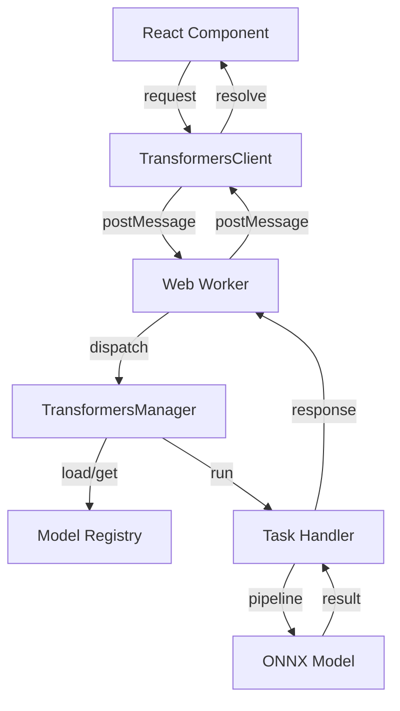

# Difference Suite - Technical Specification

> **Version**: 0.1.0 | **Last Updated**: March 23, 2026
> **Application**: Difference Suite — A Critical Deep Learning Toolkit for Digital Humanities

---

## 1. Executive Summary

### 1.1 Application Purpose

The **Difference Suite** is a React-based web application that serves as the "Little Tool of Difference" for the DEEP CULTURE ERC Advanced Grant project. It operationalizes critical humanities concepts into interactive deep learning analysis tools, enabling researchers to explore how AI renders culture as vectors, surfaces algorithmic ambiguities, and makes deep learning's inner workings visible and contestable.

### 1.2 Target Users

- Digital humanities researchers
- Cultural studies scholars
- Holocaust and archive specialists
- AI ethics researchers
- Students and educators at academic institutions

### 1.3 Core Functionality

- **Data Management**: Import images, text, audio via drag-and-drop, folder upload, webcam, or microphone
- **Collection Organization**: Group and manage data items in named collections
- **Deep Learning Analysis**: 13 specialized tools for exploring AI vectorization, classification, and generation
- **Private & Local**: All inference runs entirely within the user's browser using WebGPU/WASM, ensuring no data ever leaves the device.
- **Academic Access Control**: University domain-based authentication

### 1.4 Tech Stack at a Glance

| Category | Technology |
|----------|------------|
| Frontend Framework | React 19.2.0 + TypeScript 5.9 |
| Build Tool | Vite (rolldown-vite 7.2.5) |
| Styling | Tailwind CSS 4.1.17 |
| State Management | Zustand 5.0.9 |
| Deep Learning | **@huggingface/transformers** (v3) + **TensorFlow.js 4.22.0** |
| Inference Engine | Web Worker + WebGPU/WASM acceleration |
| Routing | React Router DOM 7.10.0 |
| Visualization | D3.js 7.9, Recharts 3.5, React Force Graph 2D |
| NLP | Compromise 14.14.4 |
| Animation | Framer Motion 12.23.25 |

---

## 2. Technology Stack (Detailed)

### 2.1 Frontend Dependencies

#### Core React

- `react`: ^19.2.0 (Latest React with concurrent features)
- `react-dom`: ^19.2.0
- `react-router-dom`: ^7.10.0 (File-based routing)

#### AI/ML Libraries

**Transformers.js v3 Stack** (Primary engine via `TransformersClient` & `Worker`):

- `@huggingface/transformers`: Browser-native inference using WebGPU (with WASM fallback).
- **Architecture**:
  - `src/workers/transformers.worker.ts`: Dedicated worker thread for heavy inference tasks.
  - `src/core/inference/TransformersManager.ts`: Manages pipelines, LRU eviction, and quantization.
  - `src/core/inference/handlers/`: Specialized logic for tasks (e.g., `feature-extraction`, `text-generation`).
- **Models Used**:
  - `all-MiniLM-L6-v2` / `bge-small-en-v1.5` (Embeddings)
  - `LaMini-Flan-T5-783M` / `SmolLM2-135M-Instruct` (Text Generation)
  - `vit-gpt2-image-captioning` / `Florence-2` (Image Captioning)
  - `whisper-tiny.en` (Speech Recognition)
  - `clip-vit-base-patch32-q4` (Multimodal Alignment & Vectorization)

**TensorFlow.js Stack** (Legacy & Specialized Training):

- `@tensorflow/tfjs`: ^4.22.0 (Client-side training for Glitch Detector, Noise Predictor)
- `@tensorflow-models/mobilenet`: ^2.1.1 (Rapid image feature extraction)
- `@tensorflow-models/knn-classifier`: ^1.2.6 (Few-shot classification)

#### Visualization

- `d3`: ^7.9.0 (Data-driven visualizations)
- `recharts`: ^3.5.1 (React charting library)
- `react-force-graph-2d`: ^1.29.0 (Network graph visualization)

---

## 3. Project Structure

```
difference-suite/
├── public/                     # Static assets
├── src/
│   ├── App.tsx                 # Root component with router
│   ├── components/
│   │   ├── dashboard/          # Data management interface
│   │   ├── shared/             # Reusable layout components
│   │   └── tools/              # 13 Analysis tools
│   │       ├── AmbiguityAmplifier/
│   │       ├── ContextWeaver/
│   │       ├── DeepVectorMirror/
│   │       ├── DetailExtractor/
│   │       ├── DiscontinuityDetector/
│   │       ├── GlitchDetector/
│   │       ├── ImaginationInspector/
│   │       ├── LatentSpaceNavigator/
│   │       ├── NetworkedNarratives/
│   │       ├── NoisePredictor/
│   │       ├── SemanticOracle/
│   │       ├── ThresholdAdjuster/
│   │       └── VisualStoryteller/
│   ├── core/
│   │   └── inference/          # Core Inference Engine
│   │       ├── handlers/       # Task-specific logic (feature extraction, etc.)
│   │       ├── modelRegistry.ts# Central configuration for all models
│   │       ├── taskHandlers.ts # Handler registration system
│   │       ├── TransformersClient.ts # Main thread client
│   │       ├── TransformersManager.ts # Worker thread manager
│   │       └── types.ts        # Shared type definitions
│   ├── workers/
│   │   └── transformers.worker.ts # Web Worker entry point
│   ├── stores/
│   │   └── suiteStore.ts       # Global Zustand state
│   └── utils/
│       └── navigation.ts       # Tool definitions and icons
├── package.json
├── tsconfig.json
├── vite.config.ts
└── tailwind.config.js
```

---

## 4. Application Architecture

### 4.1 Inference Architecture

The application uses a **Client-Worker** pattern to keep the UI responsive during heavy ML operations.



### 4.2 Robustness Features

- **LRU Eviction**: The `TransformersManager` automatically unloads least-recently-used models to prevent browser crashes (OOM).
- **Auto-Recovery**: If the Web Worker crashes, `TransformersClient` automatically restarts it (up to 3 times) and rejects pending requests gracefully.
- **Multimodal Fallbacks**: Handlers for models like CLIP automatically handle missing modalities (e.g., providing dummy images for text-only requests) to satisfy ONNX graph requirements.

---

## 5. Tool Documentation (Updated)

### 5.1 Deep Vector Mirror
**Backend**: `TransformersClient` (Worker)
**Model**: `clip-vit-base-patch32-q4` (Image/Text) or `bert-base-uncased` (Text)
**Features**:
- **Attention Lens**: Now fully implemented using `attention-analysis` handler. Visualizes real self-attention weights from the model's layers.
- **Robust Vectorization**: Supports batch processing via `.tolist()` reshaping.

### 5.2 Glitch Detector
**Backend**: `TransformersClient` + `TensorFlow.js` (KNN)
**Model**: `bge-small-en-v1.5` (Text Embedding) / `clip-vit-base-patch32-q4` (Image Embedding)
**Update**: Fixed image payload handling to correctly extract visual features instead of defaulting to empty text embeddings.

### 5.3 Detail Extractor
**Backend**: `TransformersClient` (Worker)
**Model**: `bge-small-en-v1.5`
**Update**: Implemented robust batch processing to handle array-of-vectors vs single-vector outputs, preventing reduce errors during clustering.

### 5.4 Semantic Oracle
**Backend**: `TransformersClient` (Worker)
**Model**: `LaMini-Flan-T5-783M` (or `SmolLM2` if enabled)
**Features**: Runs generative text inference locally. Supports `Define`, `Expand`, `Tangent` modes.

### 5.5 Visual Storyteller
**Backend**: `TransformersClient` (Worker)
**Model**: `vit-gpt2-image-captioning`
**Features**: Local image captioning.

---

## 6. Build & Deployment

### 6.1 Development

```bash
npm install
npm run dev
```

### 6.2 Production

```bash
npm run build
npm run preview
```

### 6.3 Configuration

- **`vite.config.ts`**: Configured to bundle the Web Worker correctly (`worker: { format: 'es' }`) and exclude transformers from optimization where necessary.
- **`.gitignore`**: Updated to exclude `dist`, `node_modules`, and local logs.

---

*Documentation generated for the DEEP CULTURE project's Difference Suite application.*
