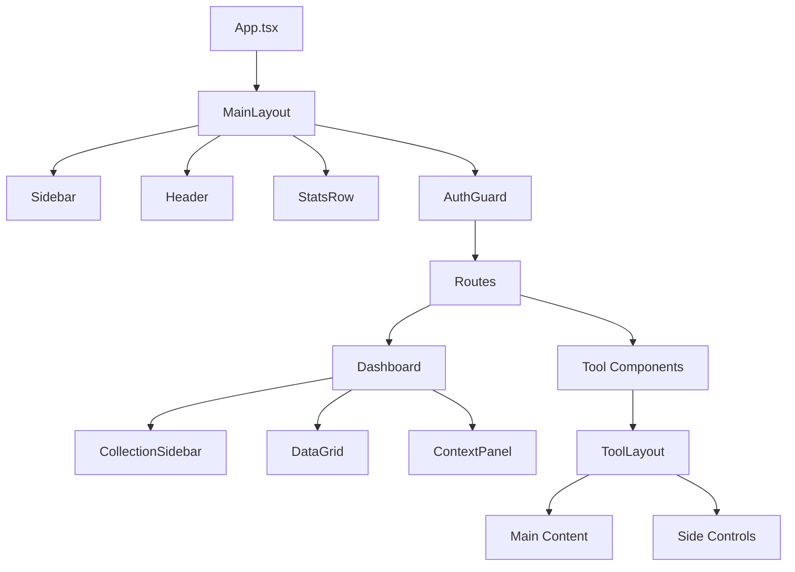
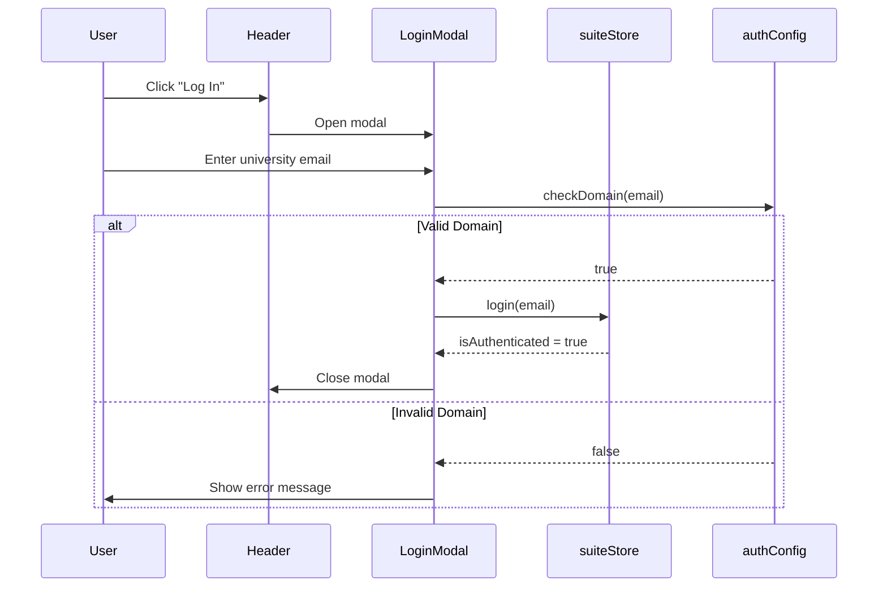
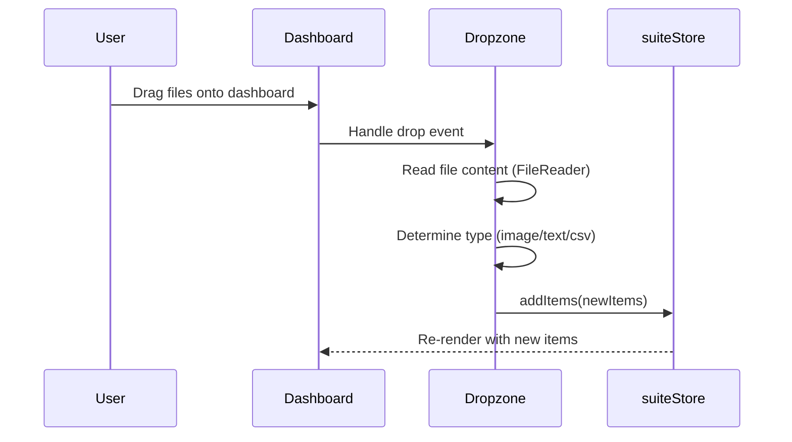
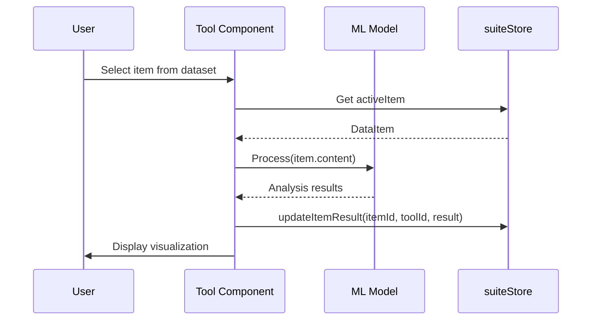

# Difference Suite - Technical Specification

> **Version**: 0.0.0 | **Last Updated**: January 17, 2026  
> **Application**: Difference Suite — A Critical Deep Learning Toolkit for Digital Humanities

---

## 1. Executive Summary

### 1.1 Application Purpose

The **Difference Suite** is a React-based web application that serves as the "Little Tool of Difference" for the DEEP CULTURE ERC Advanced Grant project. It operationalizes critical humanities concepts into interactive deep learning analysis tools, enabling researchers to explore how AI renders culture as vectors, surfaces algorithmic ambiguities, and makes deep learning's inner workings visible and contestable.

### 1.2 Target Users

- Digital humanities researchers
- Cultural studies scholars  
- Holocaust and archive specialists
- AI ethics researchers
- Students and educators at academic institutions

### 1.3 Core Functionality

- **Data Management**: Import images, text, audio via drag-and-drop, folder upload, webcam, or microphone
- **Collection Organization**: Group and manage data items in named collections
- **Deep Learning Analysis**: 13 specialized tools for exploring AI vectorization, classification, and generation
- **Academic Access Control**: University domain-based authentication

### 1.4 Tech Stack at a Glance

| Category | Technology |
|----------|------------|
| Frontend Framework | React 19.2.0 + TypeScript 5.9 |
| Build Tool | Vite (rolldown-vite 7.2.5) |
| Styling | Tailwind CSS 4.1.17 |
| State Management | Zustand 5.0.9 |
| Deep Learning | TensorFlow.js 4.22.0 |
| Routing | React Router DOM 7.10.0 |
| Visualization | D3.js 7.9, Recharts 3.5, React Force Graph 2D |
| NLP | Compromise 14.14.4, Universal Sentence Encoder |
| Animation | Framer Motion 12.23.25 |

---

## 2. Technology Stack (Detailed)

### 2.1 Frontend Dependencies

#### Core React

- `react`: ^19.2.0 (Latest React with concurrent features)
- `react-dom`: ^19.2.0
- `react-router-dom`: ^7.10.0 (File-based routing)

#### AI/ML Libraries

**Transformers.js Stack** (Primary engine for 10/13 tools via `TransformersManager.ts`):

- `@xenova/transformers`: Browser-native Hugging Face models using WebGPU/WASM
- **Models Used**:
  - `all-MiniLM-L6-v2` (Embeddings: Context Weaver, Latent Navigator, Glitch Detector, Noise Predictor)
  - `LaMini-Flan-T5-783M` (Generative Text: Semantic Oracle)
  - `vit-gpt2-image-captioning` (Image Descriptions: Visual Storyteller)
  - `whisper-tiny.en` (Speech Recognition: Audio capture/transcription)
  - `CLIP` (Multimodal Alignment: Imagination Inspector, Networked Narratives)

**TensorFlow.js Stack**:

- `@tensorflow/tfjs`: ^4.22.0 (Custom model training: Noise Predictor, Discontinuity Detector)
- `@tensorflow-models/mobilenet`: ^2.1.1 (Base image classification)
- `@tensorflow-models/knn-classifier`: ^1.2.6 (Real-time classification in Ambiguity Amplifier)

#### Visualization

- `d3`: ^7.9.0 (Data-driven visualizations)
- `recharts`: ^3.5.1 (React charting library)
- `react-force-graph-2d`: ^1.29.0 (Network graph visualization)

#### NLP

- `compromise`: ^14.14.4 (Natural language processing)

#### UI/UX

- `lucide-react`: ^0.555.0 (Icon library)
- `framer-motion`: ^12.23.25 (Animation)
- `clsx`: ^2.1.1 (Conditional classnames)
- `tailwind-merge`: ^3.4.0 (Tailwind class merging)
- `react-dropzone`: ^14.3.8 (File drag-and-drop)

### 2.2 Build & Development Tools

- **Bundler**: Vite (using rolldown-vite fork for experimental features)
- **TypeScript**: ~5.9.3 with strict mode
- **CSS Framework**: Tailwind CSS 4.1.17 with PostCSS
- **Linting**: ESLint 9.39 with React Hooks plugin
- **Package Manager**: npm (based on package-lock.json)

---

## 3. Project Structure

```
difference-suite/
├── public/                     # Static assets
├── src/
│   ├── App.tsx                 # Root component with router
│   ├── main.tsx               # Entry point
│   ├── index.css              # Global styles + Deep Culture design system
│   ├── App.css                # App-level styles
│   ├── assets/                # Static assets (images, SVGs)
│   ├── components/
│   │   ├── auth/              # Authentication components
│   │   │   ├── AuthGuard.tsx      # Route protection wrapper
│   │   │   └── LoginModal.tsx     # University login modal
│   │   ├── dashboard/         # Data management interface
│   │   │   ├── Dashboard.tsx      # Main data dashboard
│   │   │   ├── CollectionSidebar.tsx   # Collection navigation
│   │   │   ├── ContextPanel.tsx   # Item details panel
│   │   │   ├── DataGrid.tsx       # Item grid display
│   │   │   └── modals/            # Webcam, audio modals
│   │   ├── shared/            # Reusable layout components
│   │   │   ├── MainLayout.tsx     # App shell (sidebar + header + content)
│   │   │   ├── Header.tsx         # Top navigation bar
│   │   │   ├── Sidebar.tsx        # Tool navigation menu
│   │   │   ├── StatsRow.tsx       # Corpus statistics display
│   │   │   ├── ToolLayout.tsx     # Standard tool layout (main + side)
│   │   │   ├── DataUploader.tsx   # File upload component
│   │   │   └── DatasetSelector.tsx # Collection picker
│   │   └── tools/             # 13 Analysis tools
│   │       ├── AmbiguityAmplifier/
│   │       ├── AmbiguityAmplifierText/
│   │       ├── ContextWeaver/
│   │       ├── DeepVectorMirror/
│   │       ├── DetailExtractor/
│   │       ├── DiscontinuityDetector/
│   │       ├── GlitchDetector/
│   │       ├── GlitchDetectorText/
│   │       ├── ImaginationInspector/
│   │       ├── LatentSpaceNavigator/
│   │       ├── NetworkedNarratives/
│   │       ├── NoisePredictor/
│   │       └── ThresholdAdjuster/
│   ├── config/
│   │   └── authConfig.ts      # University domain whitelist
│   ├── stores/
│   │   └── suiteStore.ts      # Global Zustand state
│   ├── types/
│   │   ├── index.ts           # TypeScript type definitions
│   │   └── modules.d.ts       # Module declarations
│   └── utils/
│       └── navigation.ts      # Tool definitions and icons
├── package.json
├── tsconfig.json
├── vite.config.ts
├── tailwind.config.js
└── vercel.json                # Deployment configuration
```

---

## 4. Application Architecture

### 4.1 Component Hierarchy



### 4.2 Routing Structure

| Route | Component | Description |
|-------|-----------|-------------|
| `/` | Dashboard | Data management home |
| `/ambiguity-amplifier` | AmbiguityAmplifier | Image/text classification ambiguity |
| `/context-weaver` | ContextWeaver | Cross-context semantic comparison |
| `/deep-vector-mirror` | DeepVectorMirror | Vectorization visualization |
| `/detail-extractor` | DetailExtractor | Text clustering and detail analysis |
| `/discontinuity-detector` | DiscontinuityDetector | Time-series anomaly detection |
| `/glitch-detector` | GlitchDetector | Anomaly detection in trained models |
| `/imagination-inspector` | ImaginationInspector | Generative AI bias exploration |
| `/latent-navigator` | LatentSpaceNavigator | Latent space interpolation |
| `/networked-narratives` | NetworkedNarratives | NLP entity graph visualization |
| `/noise-predictor` | NoisePredictor | Noise pattern visualization |
| `/threshold-adjuster` | ThresholdAdjuster | Decision threshold exploration |

### 4.3 State Management Architecture

The application uses **Zustand** for global state management via a single store:

```typescript
// src/stores/suiteStore.ts
interface SuiteState {
    // Data Management
    dataset: DataItem[];           // All uploaded items
    collections: Collection[];     // Named item groups
    activeItem: string | null;     // Currently focused item ID
    selectedItems: string[];       // Multi-selection support
    isProcessing: boolean;         // Global loading state
    
    // Authentication
    isAuthenticated: boolean;
    userEmail: string | null;
    
    // Actions
    addItem(item: DataItem): void;
    addItems(items: DataItem[]): void;
    removeItem(id: string): void;
    createCollection(name: string, description?: string): string;
    moveItemsToCollection(itemIds: string[], collectionId: string | null): void;
    toggleSelection(id: string, multi?: boolean): void;
    updateItemResult(itemId: string, toolId: string, result: any): void;
    login(email: string): void;
    logout(): void;
    clearDataset(): void;
}
```

### 4.4 Data Types

```typescript
// src/types/index.ts
type DataType = 'image' | 'text' | 'timeseries' | 'tabular' | 'audio';

interface DataItem {
    id: string;
    name: string;
    type: DataType;
    collectionId?: string;
    content: string | File;        // URL or raw text
    rawFile?: File;
    metadata?: {
        size: number;
        lastModified: number;
        mimeType: string;
    };
    embedding?: number[];          // Computed vector
    analysisResults?: Record<string, any>;
}

interface Collection {
    id: string;
    name: string;
    created: number;
    description?: string;
}
```

---

## 5. Design System

### 5.1 Deep Culture Visual Identity

The application implements the Deep Culture brand from [deep-culture.org](https://deep-culture.org/):

```css
:root {
    --color-text: #000100;          /* Black */
    --color-main: #832161;          /* Deep Magenta */
    --color-alt: #ADFC92;           /* Neon Green */
    --color-background: #99B2DD;    /* Soft Blue */
    --font-main: 'Lexend', sans-serif;
}
```

### 5.2 Component Classes

| Class | Purpose |
|-------|---------|
| `.deep-panel` | Card containers with border and shadow |
| `.deep-button` | Primary action buttons (green background) |
| `.deep-button-secondary` | Secondary buttons (white background) |
| `.deep-input` | Form input fields |
| `.nav-item` | Sidebar navigation items |
| `.dc-card` | Tool panel containers |

---

## 6. Tool Documentation

### 6.1 Ambiguity Amplifier

**Path**: `/ambiguity-amplifier`  
**Purpose**: Surfaces classification ambiguity in image and text predictions

**Functionality**:

- **Image mode**: Loads MobileNet model via TensorFlow.js; highlights low-confidence predictions.
- **Text mode**: Uses Transformers.js embeddings (all-MiniLM-L6-v2) + TensorFlow.js KNN classifier to classify text concepts.
- Allows users to compare two concepts and test how a model categorizes input between them.
- Highlights "borderline" cases where the model is uncertain.

**Key Dependencies**: `@tensorflow-models/mobilenet`, `@tensorflow-models/knn-classifier`, `@xenova/transformers`

---

### 6.2 Context Weaver

**Path**: `/context-weaver`  
**Purpose**: Maps data items across different semantic and cultural contexts

**Functionality**:

- **Semantic Extraction**: Uses **Transformers.js (all-MiniLM-L6-v2)** to extract semantic keywords from collection items.
- **Context Mapping**: Computes cosine similarity between a query (text or image) and multiple defined "contexts".
- Renders radial visualization showing the relative position of items across contexts.
- Enables multi-contextual comparison of the same data item.

**Key Dependencies**: `@xenova/transformers` (all-MiniLM-L6-v2), D3.js (radial visualization)

---

### 6.3 Deep Vector Mirror

**Path**: `/deep-vector-mirror`  
**Purpose**: Visualizes the high-dimensional vector representations used by deep learning models

**Functionality**:

- **Attention Lens**: Uses **Transformers.js** to extract and visualize attention weights from text inputs, showing which tokens the model prioritizes.
- **Multimodal Vector Analysis**: Visualizes image and text vectors as structured heatmaps and distance matrices.
- **Vector Arithmetic**: Enables exploration of vector similarity (cosine distance).

**Key Dependencies**: `@tensorflow/tfjs`, `@xenova/transformers`, `D3.js`

---

### 6.4 Detail Extractor

**Path**: `/detail-extractor`  
**Purpose**: Clusters texts and extracts marginal details (Holocaust research focus)

**Functionality**:

- Processes texts via Universal Sentence Encoder
- Clusters semantically similar documents
- Highlights outliers and unique details
- Demo texts focus on Holocaust resistance narratives

---

### 6.5 Discontinuity Detector

**Path**: `/discontinuity-detector`  
**Purpose**: Detects anomalies in time-series data

**Functionality**:

- Parses CSV/JSON time-series data
- Uses deep anomaly detection algorithms
- Visualizes timeline with anomaly markers
- Provides anomaly inspector panel

---

### 6.6 Glitch Detector

**Path**: `/glitch-detector`  
**Purpose**: Identifies inputs that confuse trained classifiers

**Functionality**:

- **Image mode**: Uses MobileNet + TensorFlow.js KNN classifier
- **Text mode**: Uses Transformers.js embeddings (all-MiniLM-L6-v2) + TensorFlow.js KNN classifier
- Trains classifier on user collections
- Tests new inputs and highlights "glitches" - low-confidence or misclassified items

**Key Dependencies**: `@tensorflow-models/knn-classifier`, `@xenova/transformers`

---

### 6.7 Imagination Inspector

**Path**: `/imagination-inspector`  
**Purpose**: Explores boundaries of generative AI imagination

**Functionality**:

- Simulates generative AI outputs for prompts
- Analyzes bias in generated content
- Generates "absence reports" for missing representations
- **CLIP multimodal alignment**: Matches prompts to dataset images using Transformers.js CLIP
- Compares standard vs. bias-aware generation with dataset grounding

**Key Dependencies**: `@xenova/transformers` (CLIP), custom `GeneratorEngine`, `BiasAnalyzer`

---

### 6.8 Latent Space Navigator

**Path**: `/latent-space-navigator`  
**Purpose**: Explores the "in-between" spaces between data categories

**Functionality**:

- **Image mode**: Uses MobileNet to interpolate between visual categories.
- **Text mode**: Uses **Transformers.js (all-MiniLM-L6-v2)** to navigate semantic vectors between two concepts.
- Generates "hidden concepts" when navigating through low-density areas of the latent space.
- Provides a real-time visualization of the path between categories.

**Key Dependencies**: `@tensorflow/tfjs`, `@xenova/transformers` (all-MiniLM-L6-v2)

---

### 6.9 Networked Narratives

**Path**: `/networked-narratives`  
**Purpose**: Visualizes relationships and entities within cultural texts

**Functionality**:

- Uses Compromise.js for NLP entity extraction (people, places, organizations).
- Renders force-directed relationship graph using `react-force-graph-2d`.
- **Visual Synapse**: Uses Transformers.js CLIP alignment to find semantically matching images from the dataset for extracted text entities.
- Enables cross-modal "synapses" between text concepts and visual evidence.

**Key Dependencies**: `compromise`, `react-force-graph-2d`, `@xenova/transformers` (CLIP)

---

### 6.10 Noise Predictor

**Path**: `/noise-predictor`  
**Purpose**: Explores noise patterns and reconstruction limits in deep learning models

**Functionality**:

- **Autoencoder Architecture**: Trains a custom TensorFlow.js autoencoder to reconstruct data through a bottleneck.
- **Text mode**: Uses **Transformers.js (all-MiniLM-L6-v2)** to provide the 512-dimensional semantic input for the autoencoder.
- **Image mode**: Uses raw image data or MobileNet features.
- **Residual Analysis**: Visualizes the "noise" (difference between original and reconstructed data) as a spectral heatmap.
- Demonstrates what the model "forgets" or "misinterprets" during compression.

**Key Dependencies**: `@tensorflow/tfjs`, `@xenova/transformers` (all-MiniLM-L6-v2)

---

### 6.11 Threshold Adjuster

**Path**: `/threshold-adjuster`  
**Purpose**: Explores decision threshold sensitivity

**Functionality**:

- Loads scored/classified data
- Interactive threshold slider
- Shows impact on classification outcomes (approved/rejected)
- Histogram visualization of score distribution
- Case list showing borderline decisions

---

### 6.12 Semantic Oracle

**Path**: `/semantic-oracle`  
**Purpose**: Local generative intelligence for concept exploration and semantic expansion

**Functionality**:

- Uses Transformers.js with LaMini-Flan-T5-783M model for local text generation
- Three interactive modes:
  - **Define**: Explains concepts clearly
  - **Expand**: Lists related concepts and hidden connections
  - **Tangent**: Generates creative, abstract metaphors
- Integrates with text corpus from the dataset for contextual analysis
- All processing runs locally in-browser via WebGPU/WASM

**Key Dependencies**: `@xenova/transformers`, `LaMini-Flan-T5-783M` model

---

### 6.13 Visual Storyteller

**Path**: `/visual-storyteller`  
**Purpose**: AI-generated narrative captions from visual content

**Functionality**:

- Uses Transformers.js with ViT-GPT2 image captioning model
- Processes images from the user's collection
- Generates natural language captions describing image content
- Maintains a story history of previous captions (last 10)
- All processing runs locally in-browser via WebGPU/WASM

**Key Dependencies**: `@xenova/transformers`, `vit-gpt2-image-captioning` model

---

## 7. Authentication System

### 7.1 "Soft Gate" Implementation

The application uses a domain-based academic access control:

```typescript
// src/config/authConfig.ts
const ACADEMIC_REGEX = /(.edu(.[a-z]{2})?|.ac.[a-z]{2})$/i;

const ALLOWED_DOMAINS = [
    'uva.nl', 'ethz.ch', 'tsinghua.edu.cn', 
    'unam.mx', 'utoronto.ca', // ... 40+ universities
];

function checkDomain(email: string): boolean {
    const domain = email.split('@')[1].toLowerCase();
    return ALLOWED_DOMAINS.includes(domain) || ACADEMIC_REGEX.test(domain);
}
```

### 7.2 Auth Flow



### 7.3 AuthGuard Component

When not authenticated:

- Content is blurred with `blur-md` CSS filter
- Overlay displays "Restricted Access" message
- Pointer events disabled on protected content

---

## 8. Data Flow Patterns

### 8.1 File Upload Flow



### 8.2 Tool Analysis Flow



---

## 9. Error Handling

### 9.1 TensorFlow.js Initialization

All ML-dependent tools check model readiness:

```typescript
const [modelReady, setModelReady] = useState(false);
useEffect(() => {
    modelManager.init().then(() => setModelReady(true));
}, []);
```

### 9.2 File Reading Errors

```typescript
reader.onerror = () => resolve('Error reading file');
```

### 9.3 No Items Selected

Tools check for active items and display informational states when no data is loaded.

---

## 10. Performance Considerations

### 10.1 Model Loading

- Models loaded lazily on first tool access
- Singleton pattern prevents duplicate model initialization
- Loading states displayed during initialization

### 10.2 Memoization

- `useMemo` for filtered items and computed values
- `useCallback` for stable function references
- Prevents unnecessary re-renders

### 10.3 Large Data Handling

- Virtual scrolling in DataGrid (implicit via overflow)
- Blob URLs for images avoid memory duplication
- UUID-based item IDs for efficient lookups

---

## 11. Build & Deployment

### 11.1 Development

```bash
npm install          # Install dependencies
npm run dev          # Start dev server at localhost:5173
npm run lint         # Run ESLint
```

### 11.2 Production

```bash
npm run build        # Create production bundle
npm run preview      # Preview production build
```

### 11.3 Deployment (Vercel)

```json
// vercel.json
{
  "rewrites": [{ "source": "/(.*)", "destination": "/" }]
}
```

---

## 12. Security Measures

| Measure | Implementation |
|---------|----------------|
| XSS Prevention | React's built-in escaping |
| Input Validation | Domain regex for auth |
| HTTPS | Vercel enforced |
| No Secrets in Frontend | Domain whitelist only |
| File Type Detection | MIME type checking |

---

## 13. Appendix: File Reference

### Entry Points

| File | Purpose |
|------|---------|
| `src/main.tsx` | React DOM root initialization |
| `src/App.tsx` | Router and route definitions |
| `index.html` | HTML shell with root element |

### State & Types

| File | Purpose |
|------|---------|
| `src/stores/suiteStore.ts` | Global Zustand store |
| `src/types/index.ts` | TypeScript interfaces |
| `src/types/modules.d.ts` | Module declarations |

### Configuration

| File | Purpose |
|------|---------|
| `src/config/authConfig.ts` | University domain whitelist |
| `src/utils/navigation.ts` | Tool definitions and icons |
| `tailwind.config.js` | Tailwind theme customization |
| `vite.config.ts` | Build configuration |
| `tsconfig.json` | TypeScript configuration |

### Layout Components

| File | Purpose |
|------|---------|
| `src/components/shared/MainLayout.tsx` | App shell structure |
| `src/components/shared/Header.tsx` | Top navigation with auth |
| `src/components/shared/Sidebar.tsx` | Tool navigation menu |
| `src/components/shared/ToolLayout.tsx` | Standard tool grid layout |
| `src/components/shared/StatsRow.tsx` | Corpus statistics |

### Auth Components

| File | Purpose |
|------|---------|
| `src/components/auth/AuthGuard.tsx` | Protected route wrapper |
| `src/components/auth/LoginModal.tsx` | University login form |

### Dashboard Components

| File | Purpose |
|------|---------|
| `src/components/dashboard/Dashboard.tsx` | Main data management |
| `src/components/dashboard/DataGrid.tsx` | Item grid display |
| `src/components/dashboard/CollectionSidebar.tsx` | Collection navigator |
| `src/components/dashboard/ContextPanel.tsx` | Item detail panel |

---

## 14. Quick Reference Guide

### Running the Application

```bash
cd difference-suite
npm install
npm run dev
# Open http://localhost:5173
```

### Understanding a New Tool

1. Check `src/utils/navigation.ts` for tool metadata
2. Find tool in `src/components/tools/{ToolName}/`
3. Main component is `{ToolName}.tsx`
4. Helper components in `components/` subfolder
5. Utilities/processors in `utils/` subfolder

### Adding a New Tool

1. Create directory: `src/components/tools/NewTool/`
2. Create main component: `NewTool.tsx`
3. Use `ToolLayout` for consistent UI
4. Add route in `src/App.tsx`
5. Add entry in `src/utils/navigation.ts`

### Modifying the Design System

1. CSS variables in `src/index.css`
2. Tailwind extensions in `tailwind.config.js`
3. Component classes in `@layer components`

---

*Documentation generated for the DEEP CULTURE project's Difference Suite application.*
